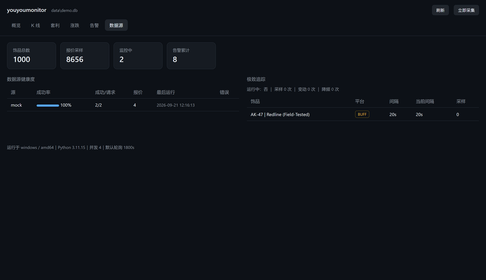

# facet

> 同一个皮肤名之下，有多个决定价格的**切面** —— 磨损、暗金/纪念品、
> 多普勒相位与宝石档、图案模板，以及「出租收租」这条低买高卖之外的收益路径。
> facet 把这些切面拆开、分别定价、给出可比较的结论。

CS 饰品市场情报工具，数据源覆盖 **网易 BUFF** 与 **悠悠有品**：
价格与在售量、求购价、K 线技术指标、跨平台套利雷达、租赁收益分析、
极致追踪、LLM 第二意见、Web 看板与命令行。
**Windows / Linux / 树莓派 同一套代码、同一条启动命令。**



---

## 一键启动

```bash
python bootstrap.py            # 任何平台都是这一条
```

或者用平台入口（内部同样调 `bootstrap.py`）：

| 平台 | 入口 |
| --- | --- |
| Windows | 双击 `start.cmd`，或 `.\start.ps1` |
| Linux / 树莓派 / macOS | `chmod +x start.sh && ./start.sh` |

它会自动完成：**找 Python → 建 venv → 装依赖（树莓派自动走 piwheels）→ 环境自检 → 启动采集+看板**。

```bash
python bootstrap.py --setup       # 只准备环境
python bootstrap.py --check       # 只自检
python bootstrap.py --collect     # 只常驻采集（树莓派省资源）
python bootstrap.py --daemon      # 后台常驻
python bootstrap.py --stop / --status
```

装成常驻服务：

```bash
sudo ./deploy/install-linux.sh              # systemd（含资源限制与优雅停止）
.\deploy\install-windows.ps1                 # Windows 计划任务（登录自启 + 崩溃重启）
```

详细部署（含树莓派 SD 卡与内存优化、SSH 转发看板、排错表）见 **[docs/DEPLOY.md](docs/DEPLOY.md)**。

---

## 配置只需一条命令

```bash
python -m facet setup        # 交互式向导：选预设 → 粘密钥 → 当场验证
```

向导**只为缺失的部分提问**，已经配好的会跳过。它把**预设写进 `config.local.yaml`**、
**密钥写进 `.env`**，两个文件都在 `.gitignore` 里，`git pull` 永远不会覆盖你的改动。

也可以一步到位（适合脚本化 / 无交互环境）：

```bash
python -m facet setup llm   --llm-preset deepseek --llm-key sk-xxx
python -m facet setup buff  --buff-cookie "session=..."
python -m facet setup csqaq --csqaq-token "xxxxx"
```

LLM 支持 10 个预设，选一个即可，模型与端点自动带出：

```bash
python -m facet advice presets    # 看全部预设、默认模型、该填哪个密钥变量
```

```
deepseek     DeepSeek      —— 便宜、中文好，CS 场景够用（推荐）
moonshot     Kimi 月之暗面  —— 长上下文
dashscope    通义千问       —— 阿里云
zhipu        智谱 GLM       —— 有免费额度
siliconflow  硅基流动       —— 聚合多模型
openai       OpenAI        —— 需要海外网络
anthropic    Claude        —— 需要海外网络
ollama       Ollama（本机）—— 完全离线，无需密钥
lmstudio     LM Studio（本机）
vllm         vLLM（本机）
```

### 配置文件分工

| 文件 | 内容 | 是否入库 |
| --- | --- | --- |
| `config.yaml` | 默认值与文档，作为模板 | ✅ 入库 |
| `config.local.yaml` | **你的个人配置**：源开关、LLM 预设、关注清单、通知渠道、端口 | ❌ 不入库 |
| `.env` | **密钥**：API Token / Cookie / Key | ❌ 不入库 |
| `config.local.example.yaml` | 上面那个的模板 | ✅ 入库 |
| `.env.example` | 密钥模板与获取指引 | ✅ 入库 |

`config.local.yaml` 只需写要覆盖的项，其余自动继承 `config.yaml`。
字典**逐键合并**（改一个源的一个字段不必整段抄），列表**整体替换**
（关注清单不会因反复运行而追加出重复项）。

---

## 能做什么

| 能力 | 说明 |
| --- | --- |
| **中文名** | 从 BUFF/CSQAQ 自动回收官方中文名（不额外发请求），三层来源可追溯 |
| **变体分类** | 磨损 5 档 / 暗金 / 纪念品 / ★ 自动解析；多普勒相位、渐变百分比、淬火蓝钢、特殊模板靠**实测学习**（见下） |
| **关注清单** | 带买卖意图、目标价、预算、可接受磨损/品质的「我真正要盯的」 |
| 双平台行情 | BUFF / 悠悠有品的在售价与在售量；悠悠有品另提供求购价 |
| 多源冗余 | 官方授权源（CSQAQ / SteamDT）+ 免登录直连源；同平台多源自动合并与交叉校验 |
| 价格告警 | 绝对阈值（跌破/涨破）、相对中位价波动、在售量骤降（被扫货） |
| K 线 + 指标 | 日线 OHLC、MA/EMA、RSI(14)、布林带、年化波动率、年化收益率、动量、最大回撤、Z 值 |
| 跨平台套利雷达 | 手续费后净收益，区分**可即时成交**与**需挂单等** |
| 极致追踪 | 单件秒级轮询；命中限流自动降频，可在约定时段静默 |
| **租赁收益** | 短租/长租日租金、平台年化、出租竞争；合成「租金 + 波动 − 手续费」的年化结论 |
| **LLM 建议** | 把行情+指标+磨损阶梯+档位+租赁+你的目标价组织成结构化上下文，强制输出含反面证据的 JSON |
| 涨跌 / 流动性榜 | 相对中位价的涨跌排行；在售量榜用于判断搬砖可行性 |
| 全文搜索 | SQLite FTS5（无 FTS5 的构建自动退回 LIKE） |
| 数据归档 | 超期明细按天聚合，一年数据从数百 MB 压到几 MB |
| 通知 | Webhook / 企业微信机器人 / Telegram / Server 酱，含静默时段与 dry-run |
| Web 看板 | 8 个标签页、**零 CDN 依赖**（树莓派离线也能看历史）、原生 Canvas K 线 |
| 环境自检 | 平台 / Python / 依赖 / 配置 / 库可写 / 凭证 / 时区 / 磁盘 / 网络连通性 |

### 变体：档位词表直接来自平台

| 变体类型 | 由什么决定 | 本工具怎么处理 |
| --- | --- | --- |
| 磨损档、暗金、纪念品、★ | 名称前后缀 | 解析，100% 可靠 |
| 多普勒相位、渐变百分比、大理石档、淬火蓝钢、特殊模板 | 饰品实例的 `paint_seed` | **采平台的档位词表** |

Steam 的 `market_hash_name` 里**没有**相位和档位信息。但实测发现：**悠悠有品的公开求购接口
直接返回平台自己分类好的中文档位名**，而且是免凭据的：

| 字段 | 实测取值 |
| --- | --- |
| `specialStyle` | `红宝石` `蓝宝石` `黑珍珠` `绿宝石` `P1` `P2` `P4` `T1` `T2` |
| `fadeText` | `99-100` `97-99`（渐变百分比区间） |
| `abradeText` | `0-0.01` `0.07-0.08`（比 5 档更精细的磨损区间） |
| `commodityName` | `刺刀（★） \| 多普勒 (崭新出厂)`（官方中文名） |

**档位价差有多大**（实测求购价）：

```
★ 刺刀 | 多普勒 (崭新出厂)
  黑珍珠 ¥12,310 ｜ 红宝石 ¥11,020 ｜ 蓝宝石 ¥7,400
  P2 ¥2,990 ｜ P4 ¥2,490 ｜ P1 ¥2,400        ← 宝石档是最低档的 5 倍

AK-47 | 表面淬火 (久经沙场)
  T1 ¥6,880 ｜ T2 ¥2,440                      ← 2.8 倍
```

把「同一把刀」当一个商品定价，等于把一辆车和它的发动机当同一个东西卖。

**BUFF 侧做不到**（实测）：`sell_order` 带 `paintseed` / `min_paintwear` / `sort_by`
任一档位筛选项即返回 `Login Required`，而基础查询可用；8 个候选档位列表端点全部
`Path Not Found`。匿名只能拿到 `paint_seed` 原始数字，拿不到档位名。

```bash
# 采集档位词表
python -m facet variants sync "★ M9 Bayonet | Doppler (Factory New)"
python -m facet variants show "★ M9 Bayonet | Doppler (Factory New)"

# 开启档位级求购价监控（config.yaml）
youpin_direct:
  tier_mode: true
```

开启后同一把刀会产出多条报价，各自带档位标签，另附一条整品汇总用于跨平台比价。

详见 **[docs/VARIANTS.md](docs/VARIANTS.md)**。

### 中文名

CS 饰品中文名是社区约定（`★ M9 Bayonet | Bright Water` → `M9 刺刀（★） | 澄澈之水`），
星标位置和语序都跟英文不同，规则推不出来。本工具从权威源**学习**：

| 来源 | 含义 |
| --- | --- |
| `learned` 官方 | BUFF / CSQAQ 响应里带的中文名 |
| `derived` 派生 | 由同皮肤其它磨损档的中文基础名 + 磨损译名拼出 |
| `composed` 拼装 | 兜底，语序可能不地道 |

中文名在**采集时自动回收**（响应里本来就有），不额外发请求 —— 这点很重要，
额外请求要花 API 限额、还可能触发风控。磨损只有 5 档而皮肤上万，
所以学一档就能推同皮肤的其它档。手工更正优先级最高，不会被自动覆盖：

```bash
python -m facet names stats
python -m facet names set "AK-47 | Redline (Field-Tested)" "AK-47 | 红线 (久经沙场)"
```

### 关注清单（我真正要买/要卖的）

`focus` 与通用 `watchlist` 是两层：前者是「执行」（带目标价、预算、可接受条件），
后者是「发现」（泛化盯盘）。

```bash
python -m facet focus add "AK-47 | Redline" --intent buy \
        --target 95 --budget 400 --wears FT,MW --priority 1
# → 自动展开成 AK-47 | Redline (Field-Tested) / (Minimal Wear) 两个标的
python -m facet focus ls        # 状态：达到买点 / 接近买点 / 等待回落
```

### 租赁收益（第二条收益路径）

CS 饰品除了低买高卖还能**出租收租**。日租金高不代表收益高 —— 本模块把租金、
市场波动、手续费、流动性合成一个结论：

```
毛租金   = 日租金 × 持有天数 × 出租率
净租金   = 毛租金 × (1 − 租赁抽成)
价格变动 = 买入价 × 持有期涨跌
卖出成本 = (买入价 + 价格变动) × (卖出抽成 + 提现费)
总收益   = 净租金 + 价格变动 − 卖出成本
```

真实样本（CSQAQ 官方文档数据，M9 刺刀多普勒）：

```
短租日租金 4.14   长租日租金 3.55      ← 短租日租金更高
短租年化   11.92%  长租年化   14.05%    ← 但长租年化更高（空置率低）

同一件饰品，持有周期决定盈亏：
  30 天  -125.4%      90 天  -20.8%      180 天  +50.0%
  ↑ 因为租金线性累积，价格变动不是
```

```bash
python -m facet rent scan            # 采集关注清单的租赁数据
python -m facet rent show "★ M9 Bayonet | Doppler (Factory New)"
python -m facet rent rank            # 按年化排行
python tools/demo_rental.py          # 用真实样本演示（不需要 Token）
```

数据来自 CSQAQ 授权接口，一次请求拿全：短租/长租日租金、平台年化、出租挂单数、
各平台在售价、1~365 天涨跌、成交量、存世量，以及**相位 ↔ paint_index 映射**
（红宝石 415 / 蓝宝石 416 / 黑珍珠 417 / Phase1-4 = 418-421）。

⚠ 两个年化率必须分清：**理论年化**（日租金×365÷价格）是满租上限，
**平台年化**是平台口径（推测已折算空置）。出租率由两者比值推算，属推算值；
平台未给年化时按保守的 60% 假设，而非满租。

详见 **[docs/RENTAL.md](docs/RENTAL.md)**。

把结构化行情事实送进模型，而不是让它凭空发挥。输出被强制为固定 JSON
（action/confidence/target/stop_loss/reasoning/**counter_evidence**/risks/data_gaps），
其中**反面证据与风险是必填** —— 只输出看多理由的建议没有决策价值。
每条建议连同数据指纹落库，价格变了就知道建议过期了。

```bash
# .env 里配置（支持任何 OpenAI 兼容端点）
#   FACET_LLM_PRESET=deepseek      # 或 openai/moonshot/dashscope/zhipu/siliconflow
#   FACET_LLM_API_KEY=sk-xxxx      # 本机 Ollama 不用密钥：FACET_LLM_PRESET=ollama
python -m facet advice config     # 看当前配置（不回显密钥）
python -m facet advice probe      # 连通性自检
python -m facet advice ask        # 对关注清单生成建议
python -m facet advice ls         # 历史建议
```

> 模型的输出是**第二意见，不是投资建议**。CS2 饰品流动性差、单件差异大、
> 受赛事与版本影响剧烈，模型看不到这些信息 —— 提示词里也明确要求它不许假设。
> 请自己核对数据后再决定。

---

## 数据源怎么选（先读这段）

| 源 | 覆盖 | 凭证 | 定位 |
| --- | --- | --- | --- |
| **CSQAQ** | BUFF + 悠悠有品 + Steam 的**在售价 + 在售量** | 免费 Token + **绑定白名单 IP** | **主力源** |
| **BUFF** | 在售价 + 在售量 + **求购价 + 求购量** | 匿名可用；Cookie 解锁更多 | 补充源 |
| 悠悠有品 | 仅求购价（+ 中文档位词表） | 免凭据 | 补充源 |
| SteamDT | 同上，另含求购价 | API Key | 低频兜底 |

### BUFF 源：匿名 vs 带 Cookie

| 接口 | 匿名 | 带 Cookie |
| --- | --- | --- |
| 在售挂单 `sell_order` | ✅ | ✅ |
| **求购挂单 `buy_order`** | ✅ | ✅ |
| `goods/info`（ID→名称） | ✅ | ✅ |
| 按名称搜索饰品 | ❌ Login Required | ✅ |
| 按 paintseed / 磨损筛选 | ❌ Login Required | ✅ |
| 成交记录 | ❌ Login Required | ✅ |

实测（`goods_id=43076`）：

```
在售价 2180 ｜ 在售量 3 ｜ 求购价 1970 ｜ 求购量 3
```

**配 Cookie 的最大价值是「用搜索替代扫描」**：没有搜索时只能扫 goods_id 空间找 ID，
而那正是会触发 IP 级风控的操作；有搜索后加一个监控只需一次精确查询。

**⚠ 匿名额度的硬边界**：BUFF 的匿名读会被用量触发的 IP 级风控整体关闭 ——
实测扫描 ID 空间后所有匿名请求转 `Login Required`，与请求头无关（六种头组合全被拦），
等待 150 秒不恢复。适配器内置 6 小时 IP 级熔断，`buff` 源默认关闭。

```bash
python -m facet setup buff     # 引导抓 Cookie 并当场验证
```

三条其它实测结论（证据见 [docs/DATA_SOURCES.md](docs/DATA_SOURCES.md)）：

1. **SteamDT 确实覆盖 BUFF 与悠悠有品** —— `platform` 枚举实测含 `BUFF`、`YOUPIN`（部分接口拼作 `UUYP`，已归一）。
2. **悠悠有品的在售价匿名拿不到** —— `sell`/`pc-onsale` 一律返回 `85100 当前app版本过低`；这是风控话术不是版本问题（扫过 5.28.3~6.0.0 六个版本全被拦）。适配器因此**如实声明 `provides_sell = False`**。
3. **悠悠有品提供权威中文档位词表** —— `specialStyle` 直接给出 `红宝石`/`P2`/`T1`，见 [docs/VARIANTS.md](docs/VARIANTS.md)。

---

## 功能来源（对三个参考项目的移植情况）

你提到要「调用这三个项目实现里面所有的功能」。已移植与未移植的情况如下，
**全部为独立实现，未复制其代码**（许可边界见 [docs/LICENSES.md](docs/LICENSES.md)）：

| 来源项目 | 功能 | 状态 |
| --- | --- | --- |
| cs-monitor | 关注清单 / 价格告警 / SQLite 存储 / Web 仪表盘 | ✅ 已实现（并可多源） |
| cs-monitor | K 线图（OHLC + MA + 成交量量能） | ✅ 已实现（原生 Canvas，无 ECharts 依赖） |
| cs-monitor | 极致追踪（秒级单件、价格+数量、429 自动降频、静默时段、自定义冷却） | ✅ 已实现 |
| cs-monitor | 多通道通知（企微 / Telegram / Server 酱） | ✅ 已实现（另加通用 Webhook） |
| cs-monitor | 90 天以上数据按天归档 | ✅ 已实现 |
| cs-monitor | 7 天均价基准 | ✅ 已实现（用中位数抗钓鱼单） |
| cs-monitor | 39,000+ 饰品本地库 + FTS 搜索 | ✅ 已实现（FTS5，可自行导入更大目录） |
| cs2-inventory-manager | RSI / 布林带 / 动量 / 波动率 / 年化收益率 | ✅ 已实现（纯 Python，无 numpy） |
| cs2-inventory-manager | 日线 OHLC 聚合 + 历史回填 | ✅ 已实现 |
| cs2-inventory-manager | 跨平台比价 / 套利雷达 | ✅ 已实现（含手续费净收益与可成交性区分） |
| cs2-inventory-manager | 盈亏统计 / 组合价值快照 | ⏳ 需要库存数据（见下） |
| cs2-inventory-manager | 上架 / 批量改价 / 转租 | ⛔ 未实现：属于**写操作**，会真实改动你的在售挂单 |
| cs2-inventory-manager | Steam 库存同步、悠悠有品买入/卖出记录导入 | ⏳ 需要 Steam API Key 与悠悠有品登录态 |
| CS2TradeMonitor | 只读监控界面与规则设计 | ✅ 已参考（看板与告警规则） |
| CS2TradeMonitor | 悠悠有品库存/租赁/0CD 转租、包租公 | ⏳ 需要悠悠有品登录态 |
| CS2TradeMonitor | 量化信号 / 回测（Chan 结构、策略目录） | ⛔ 未移植：属于策略层，与「监控」定位不同 |

**关于 ⏳ 与 ⛔ 两类：**

- ⏳ 类功能（持仓成本、盈亏、租赁收益）依赖**你的账户数据**：需要 Steam Web API Key、
  悠悠有品登录态或交易记录导入。底层表结构已预留（`items.buff_goods_id` /
  `youpin_template_id`、`ohlc_cache`、`archived_prices`），接上账户后可直接计算。
  如果你要开这部分，告诉我你手上有哪些凭证（Steam API Key / 悠悠有品设备标识），
  我按真实字段接入 —— 不猜字段名，避免又一轮「接口改了导致静默失效」。
- ⛔ 类功能是**会自动下单/改价/转租的写操作**。这类能力默认不接：监控工具误操作
  的代价是真金白银，而我在本地无法对真实账户做端到端验证。要做的话建议独立成
  CLI 命令 + 强制 dry-run 预览 + 显式二次确认，而不是塞进常驻采集循环。

---

## 架构

```
bootstrap.py          一键启动器（跨平台，唯一实现）
start.sh / .ps1 / .cmd 三个平台入口（薄壳）
facet/
├── platform.py       平台探测与调优（Windows/Linux/树莓派）
├── doctor.py         启动前自检
├── config.py         配置（YAML + .env 自动加载）
├── models.py         跨源统一模型
├── store.py          SQLite：报价时序 / 身份映射 / K 线缓存 / 归档 / FTS / 追踪
├── ratelimit.py      端点级限速闸门 + 指数冷却
├── mapping.py        market_hash_name ⇄ buff_goods_id ⇄ youpin_template_id
├── indexer.py        BUFF goods_id 索引器（游标持久化，可中断续跑）
├── indicators.py     技术指标（纯 Python，无 numpy）
├── analytics.py      日线 OHLC / K 线束 / 套利雷达 / 涨跌榜
├── alerts.py         告警引擎（含跨源冲突抑制）
├── extreme.py        极致追踪（秒级轮询 + 自适应降频）
├── notify.py         通知渠道
├── scheduler.py      调度：多源并发采集 → 落库 → 告警 → 推送
├── dashboard.py      看板前端（单页，零 CDN）
├── web.py            FastAPI 看板 + REST API
└── sources/          适配器（csqaq / steamdt / buff_direct / youpin_direct / mock）
deploy/               systemd 与 Windows 计划任务安装脚本
tools/                演示数据、映射迁移等一次性脚本
```

### 几个值得说明的取舍

**跨源冲突抑制。** 同一 (饰品, 平台) 若被多源覆盖且价差超过 25%，判定为脏数据，
**不出告警并记录冲突** —— 发一条错误告警比不发更糟。

**基准价用中位数。** 1 元钓鱼单不会把基准拉低、让「下跌 8%」永远误触发。

**并排时间戳必须定序。** `price_history` 的 `ORDER BY` 带 `id` 兜底：否则同一时间戳的
多条记录会按索引内 rowid 逆序返回，K 线的开/收盘价会在两次查询间漂移。（这是测试抓出来的真 bug。）

**看板零 CDN。** K 线用原生 Canvas 画。树莓派常部署在无外网环境，
而「数据源全挂时至少还能看库里的历史」正是监控工具最有价值的兜底能力。

**看板只绑回环。** 监控清单本身暴露你的持仓意向，属敏感信息。远程请用 SSH 端口转发。

---

## 命令速查

```bash
# 采集 / 运行
python -m facet run [--loop] [--interval N] [--source csqaq]
python -m facet serve [--host H] [--port P]
python -m facet doctor [--no-network] [--json]

# 监控与追踪
python -m facet watch add "AK-47 | Redline (Field-Tested)" --below 100 --drop 8
python -m facet watch ls / rm "名称"
python -m facet extreme add "AK-47 | Redline (Field-Tested)" --platform BUFF \
        --interval 30 --price-threshold 0.5 --quiet-start 23 --quiet-end 8
python -m facet extreme ls / rm / run

# 分析
python -m facet kline "AK-47 | Redline (Field-Tested)" --platform BUFF --days 90
python -m facet spread --min-percent 3 --min-profit 1
python -m facet movers --hours 168 --liquidity
python -m facet search "AK-47"

# 中文名
python -m facet names stats
python -m facet names show "AK-47 | Redline (Factory New)"
python -m facet names set "AK-47 | Redline (Field-Tested)" "AK-47 | 红线 (久经沙场)"

# 关注清单（带买卖意图）
python -m facet focus add "AK-47 | Redline" --intent buy --target 95 --wears FT,MW
python -m facet focus ls / detail "名称" / rm "名称" --expand

# 图案档位（多普勒相位 / 渐变 / 淬火 / 特殊模板）
python -m facet patterns init
python -m facet patterns learn "★ 卡兰比特 | 多普勒 (崭新出厂)"
python -m facet patterns show "Doppler"
python -m facet patterns stats

# 租赁收益
python -m facet rent scan                 # 采集关注清单的租赁数据
python -m facet rent show "★ M9 Bayonet | Doppler (Factory New)"
python -m facet rent rank --min-liquidity 30
python -m facet rent ls / detail "名称"

# LLM 建议
python -m facet advice config / probe
python -m facet advice ask [名称]
python -m facet advice ls / show "名称"

# 数据维护
python -m facet index status / resolve / scan
python -m facet seed                       # 导入参考项目的映射资源
python -m facet archive run --keep-days 90
python -m facet archive ohlc --days 365
python -m facet archive prune-extreme --keep-days 7
python -m facet report
python -m facet sources / probe
```

---

## 测试

```bash
python -m pytest tests -q        # 224 项，全部离线，不触网
```

覆盖：**名称解析边界**（括号非磨损、无磨损档品类、★+StatTrak 组合、变体展开防重复前缀）、
中文名三层来源与优先级、**变体分组与磨损阶梯**、关注清单状态判定、
**图案档位实测学习**（溢价种子识别、样本不足不造档位）、
技术指标（含手工可验算的 RSI 经典序列）、OHLC 聚合与并列时间戳定序、
套利净收益与手续费口径、存储（身份合并/基准中位数/归档/FTS/游标/前向迁移）、
告警规则与冲突抑制、四个适配器的解析与风控分支、极致追踪的降频恢复、
LLM 客户端（三种协议、错误脱敏、JSON 抽取的四种形态）、建议生成与过期判定、
平台探测、.env 解析、自检报告、看板 API 与调度器集成。

---

## 合规与边界

- **优先使用授权数据服务。** 悠悠有品用户协议限制突破反爬措施获取信息，
  因此本项目**不实现**其售后售价的绕过方案（不模拟登录态、不逆向签名）。
- **BUFF 直连只用公开免登录接口**，不做登录态模拟，并内置 IP 级熔断。
- **看板默认只绑 `127.0.0.1`。**
- **凭证只走环境变量 / `.env`**，已在 `.gitignore` 中；密钥不写入 YAML。
- `refs/` 含 GPL-3.0 项目源码，已 gitignore；对外分发前请确认排除。

## 文档

- [docs/DEPLOY.md](docs/DEPLOY.md) — 部署与排错（Windows / Linux / 树莓派）
- [docs/VARIANTS.md](docs/VARIANTS.md) — 变体分类、中文名、关注清单、LLM 上下文
- [docs/RENTAL.md](docs/RENTAL.md) — **租赁收益模型、两个年化率的区别、费率覆盖**
- [docs/DATA_SOURCES.md](docs/DATA_SOURCES.md) — 数据源接口、字段、限额、覆盖矩阵与实测证据
- [docs/REVERSE_ENGINEERING.md](docs/REVERSE_ENGINEERING.md) — 接口逆向过程与踩过的坑
- [docs/LICENSES.md](docs/LICENSES.md) — 参考项目许可与复用边界
